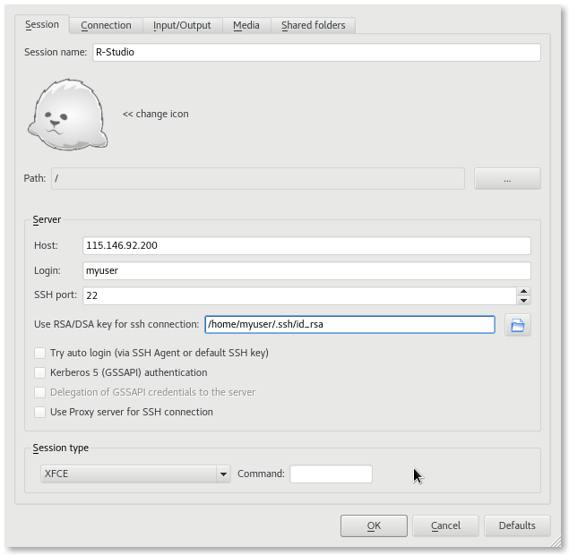

---

id: applications
summary: Learn to quick deploy an application environment from our catalog with this R-Studio example.
categories: Beginner
tags: application, dashboard, R-studio, shiny, x2go, guacamole, remote desktop
difficulty: 1
status: draft
feedback_url: https://github.com/JustBerkhout/tutorials.ubuntu.com/issues
published: 2019-08-15
author: Mark Endrei <mark.endrei@uq.edu.au>

---

# Applications

## Overview

Duration: 1:00

### What are Applications

Nectar have packaged some cloud-ready applications into the *Application Catalog* available from your [Nectar dashboard](https://dashboard.rc.nectar.org.au). You can browse the catalog and compose your own application environments running on the Nectar Research Cloud.

In this tutorial you'll step through the *Quick Deploy* process for configuring and deploying an application from the catalog. Our example will be an *R-Studio* application. It gives secure access to a community edition R-Studio server, Shiny server as well as remote-desktop-based access via either your browser or X2Go.

positive
: **Cloud Starter**
You should have a Keypair registered in your Nectar account. If you think you need help with that, you should complete Cloud Starter tutorials before you start here. 

### What you'll learn

- Deploy an application environment in your Nectar Project

### What you'll need

- Keypair registered in your Nectar account
- X2Go software (optional)
- Access to a Nectar Project
- Access to a volume storage allocation (optional)

## Browsing the Application Catalog

Duration: 3:00

In this tutorial we will browse the Application Catalog and use *Quick Deploy* to configure your own instance of R-Studio running on Nectar. 

1. Log on to on your [Nectar Dashboard](https://dashboard.rc.nectar.org.au) and ensure you're working in the right project (Use the project selector on the top left-hand side)
2. Navigate to the `Applications | Browse | Browse Local` page 
3. If you don't immediately see the application you need, just type it into the search field on the right. For this tutorial, let's find `R-Studio`
4. Once you've found it, click `Quick Deploy`.

## Configure the Application

Duration: 2:00

`Quick Deploy` guides you through the steps to configure your application environment.

### Flavor and Key Pair

Choose your desired **Instance Flavor**, **Key pair** and the **Availability Zone**. Click `Next` to continue.

positive
: With R-Studio you can select an existing volume for application data storage. If you plan to use an existing volume, make sure your volume and application environment are in the same Availability Zone.

### Host name and DNS Zone

You can choose an optional **Host name** and **DNS zone** name for your instance. If you choose a DNS zone at this stage, we will automatically create a DNS entry for you and provision a HTTPS security certificate for your instance.

positive
: **Highly recommended**
Choosing an easy Host name and associating your project's DNS zone is highly recommended. Not only will you be able to access your R-Studio on the slick URL of `https://[hostname].[project].cloud.edu.au`, your R-Studio instance will be setup with encrypted communications (i.e. `https`), significantly improving the security of you instance.

### Existing Volume

Select your volume, if required. Click `Next` to continue.

### User Details

In this step, you should provide your desired **Username** and **Password** for R-Studio. You will be prompted for these later once the application has been deployed. Click `Next` to continue.

The last step allows you to provide a name. You can keep the default, *R-Studio*, or supply your own. Click `Next` to continue.

## Deploy the Environment

Duration: 10:00

### Start the Deployment

When you finish configuring the application you will be taken to the Application Environments screen. You'll want to click the `Deploy This Environment` button to kick off the deployment.

The application is now being deployed. This usually takes around 5 to 10 minutes to complete the setup process.

### Environment Deployed

Your application is now deployed and ready. You should see the **Last Operation** message appear with the Internet address of your application instance. You can click this link to get started.

## Try Out Your Application

Duration: 7:00

Once you log in with the **Username** and **Password** you provided earlier, you will reach the R-Studio landing page in this example.

You can launch R-Studio from here. We also provide a link to Shiny Server that has also been installed, and a link to access the instance desktop via browser.

R-Studio will require you to log in again with the **Username** and **Password** you provided earlier.

R-Studio is now available!

This application also offers access to R-Studio through *Remote Desktop* via *X2Go*. This might be especially useful for workloads that require visualisations that can't be handled from within the browser environment.

If you would like to use the Remote Desktop interface, you should install the *X2Go client*. It is available for Windows, Mac and Linux from [x2go.org](https://x2go.org).

Once installed and running, you should click the `Create Session` button and provide the **Host**, **Login** and **SSH keypair** details. Your **Session type** should be XFCE.

| Setting      | Description                                                  |
| ------------ | ------------------------------------------------------------ |
| Host         | use the instance IP address, or the hostname `[hostname].[project].cloud.edu.au` |
| Login        | use the username you created in the *Configure Application* dialog |
| RSA/DSA key  | use the private key that corresponds to the key you chose in the *Configure Application* dialog |
| Session type | use *XFCE*. The application is preconfigured with the XFCE desktop environment |

Once you have created the session and connected, the XFCE desktop environment will appear and you can launch R-Studio from the Applications menu.

## Next Steps

Duration: 1:00

You have launched an application environment in the Nectar Research cloud. You have used the Quick Deploy process from the Nectar dashboard. You configured and deployed the application then confirmed that it is up and running on the Nectar cloud. Upon successful deployment your Nectar dashboard shows an active application environment on the `Environments` page. You can access your environment using preconfigured access methods. In our R-Studio example a web-based R-Studio server, Shiny-server and Remote Desktop, and additionally a X2Go-based remote desktop. 

positive:
**You can still use `ssh`/Terminal/command line too**
The instance is accessible using Terminal software and `ssh` too. 

positive
: **Application catalog**
In this tutorial you've learnt to launch an application from our Nectar Application catalog. You've use an R-Studio example. Browse through the [Applications catalog](https://dashboard.rc.nectar.org.au/app-catalog/catalog/) to see our other preconfigured applications.