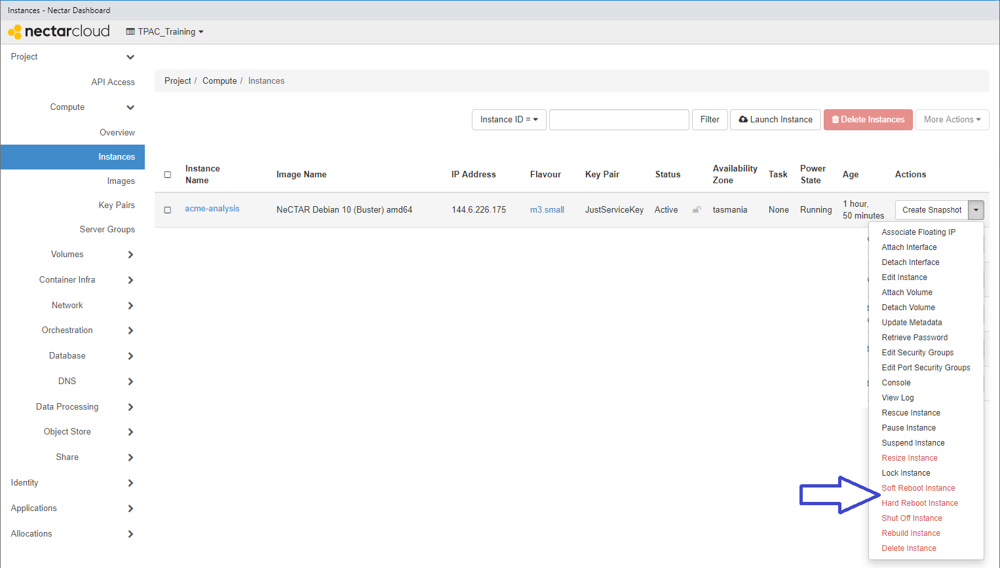
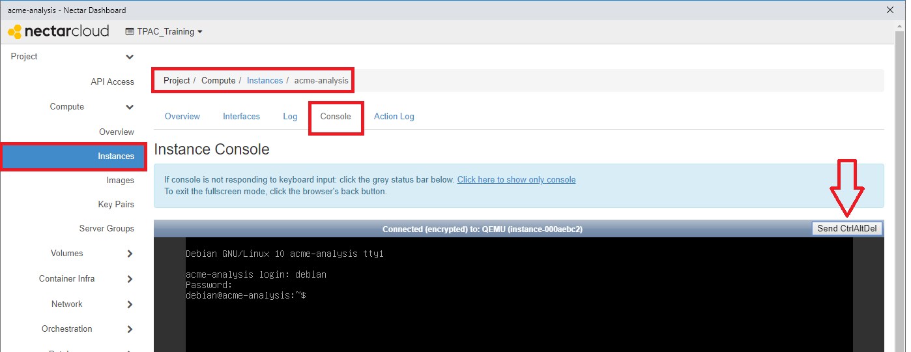
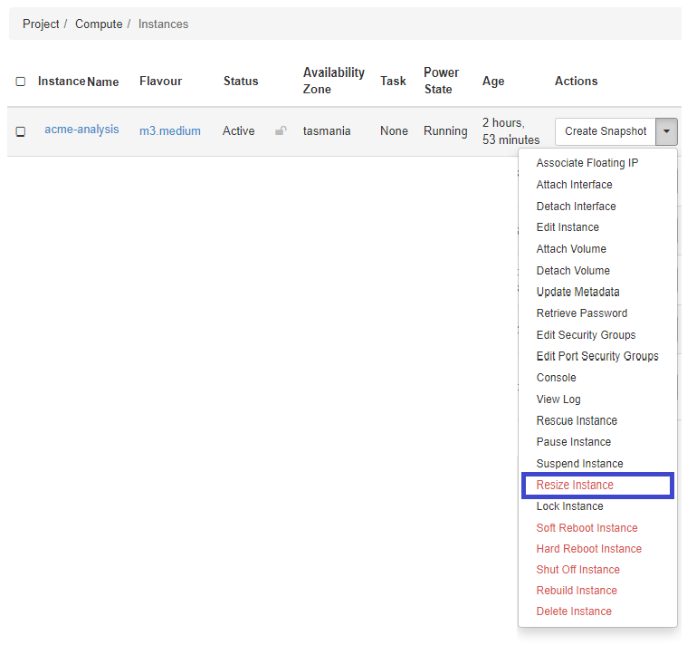
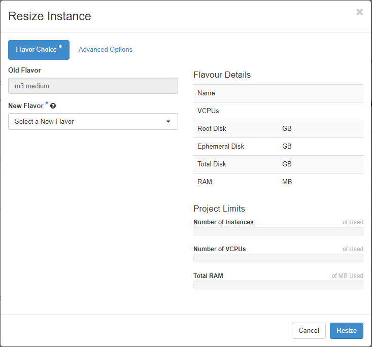
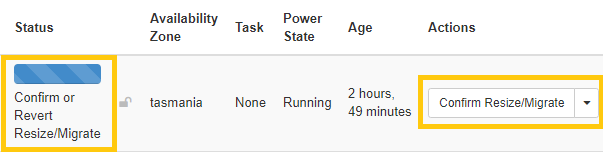
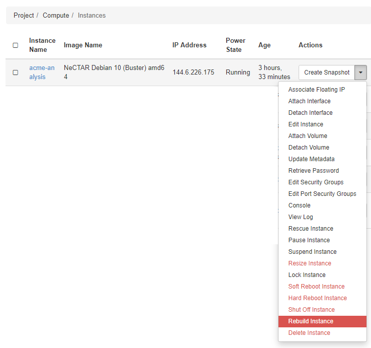
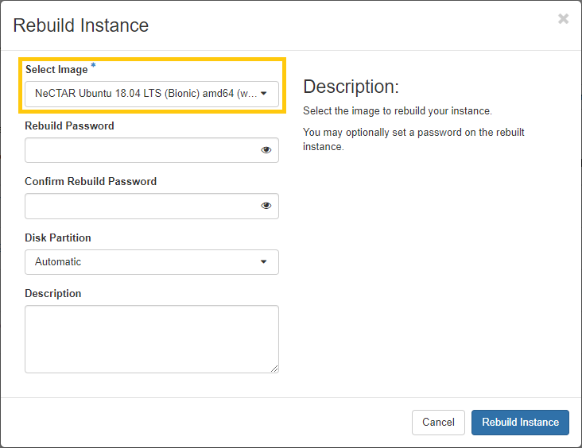
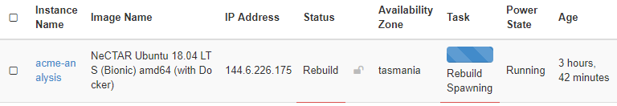
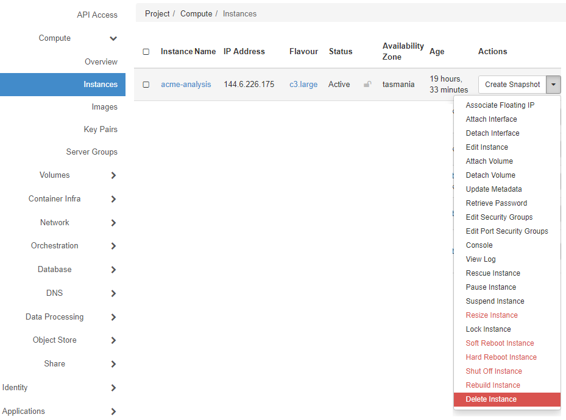

# Rebooting, Resizing, Rebuilding, Deleting

## Overview

Duration: 2:00

Virtual Machines in the Nectar Research Cloud are very flexible. You have control over the size and number of instances you launch in your project. Occasionally you'll have reason to *reboot* your instance. If you didn't really get your instance quite right on your first try, you can *rebuild* it with a different image, or a *resize* it to a different flavour. When you're done with an instance you can just *delete* it: no need for recycling or eBay.  

### What you'll learn

- Life-cycle events of your instance: *Rebooting*, *Resizing*, *Rebuilding*, *Deleting*.
- Use the Instance Action Menu Button

### What you'll need

- Some spare capacity in your Nectar Research Cloud account for launching a trial instance and/or resizing an instance.

positive
: **Setting up**
As we'll be quite destructive in the sections *Rebuilding* and *Deleting* below, we strongly recommend you launch an instance specifically for the purpose of this tutorial.

## Rebooting

Duration: 10:00

From time to time you may find the need to reboot your instance. Whether a software install or upgrade as part of a troubleshooting task. Below are a number of ways you can reboot your instance. 

### From the `ssh` command line

You can use the Linux command `shutdown` from your `ssh` command line. During shutdown and reboot your `ssh`-connection will be broken, but after successful rebooting you can reconnect to your instance. 

The command for rebooting from the command line is given below:

```bash
$ sudo shutdown -r now
```

You will typically need `sudo`-elevation to use the `shutdown`-command. You ask for a reboot using the `-r` argument. And you can indicate when you want the shutdown/reboot to take place. We're using `now`.

It typically takes a minute or so for an instance to be accessible again. In this time you won't be able to connect.

An example is show here

```bash
me@local:~$ ssh debian@144.6.226.175
debian@acme-analysis:~$ sudo shutdown -r now
Connection to 144.6.226.175 closed by remote host.
Connection to 144.6.226.175 closed.
me@local:~$ ssh debian@144.6.226.175
ssh: connect to host 144.6.226.175 port 22: Connection refused
me@local:~$ ssh debian@144.6.226.175
debian@acme-analysis:~$
```

### From the instances tab

You can reboot your instances from the Nectar Dashboard Instances page. 



Choose from *Soft Reboot Instance* and *Hard Reboot Instance*. 

> With a soft reboot, the operating system is signaled to restart, which allows for a graceful shutdown of all processes. A hard reboot is the equivalent of power cycling the server. 

### From the instance vnc-console

You can also restart the instance from the Console in the Console tab on the Instance Detail page for your instance. Use the button `Send CtrlAltDel` send the reboot request. This option is useful in the unlikely event you need [recovery options](https://support.ehelp.edu.au/support/solutions/articles/6000194010-recovery-options-when-you-cannot-access-your-instance). 




## Resizing

Duration: 5:00

One benefit of Virtual Machines over physical ones is that the virtual ones you can actually make bigger. Increasing the number of CPUs, the RAM and the hard drive in your computer was never this easy.

Navigate to the Instances page on your Nectar Dashboard, and select *Resize instance* from the Action Menu of the instance you would like to resize. This will take you to the *Resize Instance dialog* where you can select a new flavour for your instance. 

### 2-step process

The resize action is a 2-step process. When you click the Resize button on the *Resize Instance Dialog* a request for *Migrate/Resize* will be submitted. Your instance page will appear, and will show relevant Status and an Action button asking you to `Confirm Resize/Migrate`. This process typically takes less than a minute. 

positive
: **Flavour constraints**
You won't be able to resize your instances beyond your allocated resource quota. There are also some constraints resizing from some instance sizes to others, mostly to do with a flavour's disk space. You can read more about it in the [Resizing documentation](https://support.ehelp.edu.au/support/solutions/articles/6000212271-resizing-nectar-instances) in the Nectar knowledge base.









## Rebuilding

Duration: 8:00

You can *Rebuild* an instance. This means that your instance will retain its flavour, volume attachments and IP-address, but it will have a new image applied to it. 

negative
: **Warning** 
The *Rebuild* action erases all data on your instance primary and ephemeral drive (if it has one), including installed software, configuration settings and user data. 








negative
: **Warning: Remote Host Identification Changed**
If you use *Rebuild* and then reconnect to your instance using `ssh` you will typically receive a `REMOTE HOST IDENTIFICATION HAS CHANGED!`-warning. This is expected behaviour after a *Rebuild* as `ssh` detects a materially different computer using an old IP-address. 

## Deleting

Duration: 6:00

By now you will have recognised a pattern in how to perform actions on your instances via the Nectar dashboard. We will perform one more: *Deleting*. When you're finished using your instance, or you are otherwise ready to throw it away, you can just Delete your instance using the Instance Action Menu. There's more info in the knowledge base about actions you can perform via the [Instance Action Menu Button](https://support.ehelp.edu.au/support/solutions/articles/6000184172-instance-action-menu-button).

negative
: **Warning**
Deleting is irrevocable. Deleting erases all data on your instance primary and ephemeral drive (if it has one), including installed software, configuration settings and user data. 

positive
: **Manage your data**
Before deleting your instance, you should manage your data. You should store your valuable data on persistent storage, e.g. [Nectar Volume Storage](https://support.ehelp.edu.au/support/solutions/articles/6000216075-persistent-volume-storage) or [File Shares](https://support.ehelp.edu.au/support/solutions/articles/6000183607-nectar-shared-filesystem-service), or [your institution storage](https://support.ehelp.edu.au/support/solutions/articles/6000136764-introduction-to-rds-participating-nodes) options or your local machine.




### Security Groups and Keypairs

Security Groups and Keypairs that were applied to your instance, are not deleted. They will be retained in your Nectar Project and Nectar Account respectively, for use with your next instance.


## Next Steps

Duration: 1:00

In this tutorial you learnt how to resize, rebuild, reboot and delete your instances using the Instance Action Menu on the Nectar Dashboard. These are four life cycle events of virtual machines help make cloud computing very flexible. You can experiment with configuration of your instances and throw them away completely guilt-free. Not to mention *free*. Full Stop.

In thus tutorial we've mentioned *managing your data* a few times. If you haven't already done so, you should learn ways of doing this in our tutorials *Volume Storage* (Nectar's virtual USB drives) and *Moving Data*.