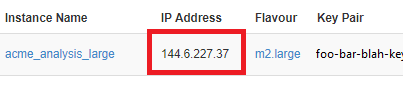
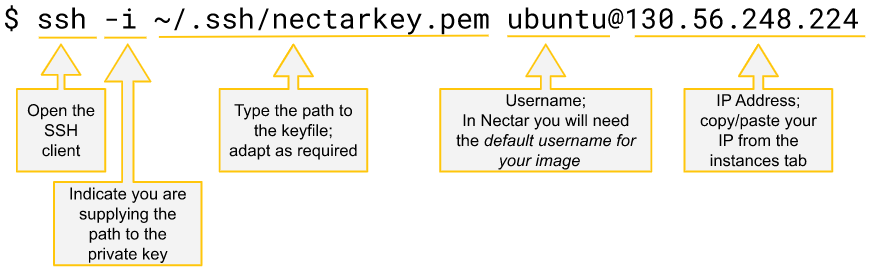
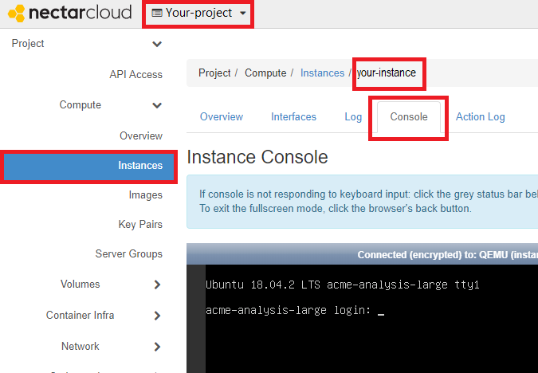

---

id: connecting
summary: Access your Virtual Machine's command line using your Terminal and ssh or the web-based vnc console.
categories: Beginner
tags: Cloud Starter, connecting, terminal
difficulty: 1
status: draft
feedback_url: https://github.com/JustBerkhout/tutorials.ubuntu.com/issues
published: 2019-05-14
author: Just Berkhout <just.berkhout@utas.edu.au>


---

# Access using `ssh` and web-based vnc

## Overview

Duration: 2:00

One of the most basic ways of driving a computer, whether virtual or physical, whether remote or local, is using the command line. The command line of remote computers, which includes our Nectar virtual machines, can be accessed using a Secure SHell (or ssh) connection. It is called "Secure" because `ssh` encrypts all its communications, and it's called a `shell`, because... well it appears that nobody really knows why it's called a *shell* ***. Nevermind.  

We can also access our instance using a webpage in the Nectar dashboard through a web-based `vnc`-console. The `vnc`-console gives us access to our instance command line, without the need for separate terminal software.

In this tutorial you will learn how to connect to our instance using [terminal software](https://support.ehelp.edu.au/support/solutions/articles/6000223964-terminal-software) and `ssh`. We'll set up a user account password to enable access to our `vnc`-console, and then connect using the `vnc`-console. 

positive
: **Cloud Starter**
This tutorial is part of the Nectar Cloud Starter curriculum. Only the bare essentials of `ssh`-connecting are explained here. The `vnc`-console is optional in the cloud starter curriculum, but it can be useful in the unlikely event of troubleshooting your instance.

### What you'll learn

- Connecting to our instance using `ssh`
- Changing a User account password using `passwd`
- Connecting to our instance using the `vnc` console in the Nectar Dashboard

### What you'll need

- [Terminal software](https://support.ehelp.edu.au/support/solutions/articles/6000223964-terminal-software) 
- A running instance in the Nectar Cloud, with your public key and an `ssh` security group applied

*** Internet pioneer [Louis Pouzin](https://en.wikipedia.org/wiki/Louis_Pouzin) coined the term *shell* for a command language in the mid 1960s.  

## Terminal and `ssh`

Duration: 6:00

To connect to your instance you need the ssh software, accessible from your terminal using the `ssh`-command. You need to pass three pieces of information to the `ssh`-command: firstly the remote computer's address, secondly the user account name and thirdly your private key. 

#### Address

When you launched your instance, Nectar gave you an IP address. In the example below the IP Address of the instance named *acme_analysis_large* is 144.6.227.37. You should find and note the IP Address of your instance now. 



#### User account

When you launched your instance, you chose an *Image*. Nectar images have all been preconfigured with a default user account. In our example we launched a Ubuntu image, which has been preconfigured with the user account `ubuntu`. Note that the Nectar-provided default user accounts are configured to have administrator privileges, so connecting with this  account gives you complete control over the VM. 

 More information about images and preconfigured default user accounts can be found in our [Image Catalog](https://support.ehelp.edu.au/support/solutions/articles/6000106269-image-catalog#username)

#### Keypair

When you launched your instance you chose a keypair from the registered keypairs in your Nectar account. Nectar has now applied the public key of that pair to the default user account on the instance. This means that you can connect to this account, on this instance by specifying the file location of the private key of that pair. You should remind yourself of the private and secure location where your private key is stored now. 

positive
: Cloud Starters
In the tutorial *Creating a keypair for use in Nectar* you have created or downloaded your Private Key. The recommended location is the `.ssh` directory in your home directory, i.e. `~/.ssh`

#### Connection

Below is the `ssh` command for our example. You should adjust it for the *private key*, *account* and *IP address* for your instance. 

Note that the `-i` is short for `identity_file`. It is the argument passed to the `ssh` command that points to your private key file.

```bash
$ ssh -i ~/.ssh/foo-bar-blah-key ubuntu@144.6.227.37
```

Or if you like diagrams with arrows:



#### Authenticity warning

When you first connect to an instance (i.e. the *host*), your local `ssh`-software does not know of that host. `ssh` warns you that it can't establish the host's authenticity. If you've just launched your instance, and you're sure that the details are correct, you can answer *"yes"* to this prompt. `ssh` will now record that this is a known host that you agree to connect to, and won't bother you with this warning again.

```bash
local-prompt:~$ ssh -i ~/.ssh/foo-bar-blah-key ubuntu@144.6.227.37
The authenticity of host '144.6.227.37 (144.6.227.37)' can't be established.
ECDSA key fingerprint is SHA256:x1iQRugzRuabgCbD4WOCVvZycpgkagQZsOkLKHdFdtE.
Are you sure you want to continue connecting (yes/no)? yes
Warning: Permanently added '144.6.227.37' (ECDSA) to the list of known hosts.
remote-prompt:~$
```

negative
: Authenticity Warning 
If you receive a similar authenticity warning *when it's not your first connection* then `ssh` is telling you that something about your instance has materially changed. There is a variety of reasons that this can happen, most (*but not all*) of them benign. You can read more about this in the Nectar Knowledge base article [troubleshooting ssh access](https://support.ehelp.edu.au/support/solutions/articles/6000149723)

You should now have a connection to your instance. Notice that the *command prompt* has subtly changed to indicate what machine and account it is representing, e.g.:

```bash
wile@acme-laptop:~$ ssh -i .ssh/wileskey ubuntu@144.6.227.37
Last login: Mon Jul 29 16:22:13 2019 from 131.217.255.76
ubuntu@acme-analysis-large:~$
```

You can disconnect from the remote computer using the `logout` command. E.g.

```bash
ubuntu@acme-analysis-large:~$ logout
Connection to 144.6.227.37 closed.
wile@acme-laptop:~$
```


## Setting a user password for vnc

Duration: 3:00

In the section after this one we'll connect to our instance using the web-based `vnc`-console. The `vnc`-console cannot use keypairs, so Nectar only provides the `vnc`-console in the secure trusted location of the Nectar dashboard. That location is secure enough to access your instance using a password.

Nectar preconfigured images, such as the Ubuntu image we used to launch our instance, do not have a password preconfigured on the default user account. So we need to set one ourselves. We'll use our `sudo` privileges to change the password on the ubuntu account as below.

```bash
$ sudo passwd ubuntu
Enter new UNIX password:
Retype new UNIX password:
passwd: password updated successfully
```

We do have some [advice on passwords](https://support.ehelp.edu.au/support/solutions/articles/6000213823-passwords).

negative
: **Important**
Password authentication and `ssh` don't mix well these days on the Internet. Automated entry attempts on well-known user accounts with well-known or stolen passwords occur continuously. Virtual machines based on Nectar official images are preconfigured to disable `ssh` password authentication to prevent this type of unauthorised access. You should not change this. 

 negative
: **Leave `ssh` password authentication disabled**
We're serious.

For more practical security guidelines and see the [security administration checklist](https://support.ehelp.edu.au/support/solutions/articles/6000091906-security-administration-checklist) in the Nectar knowledge base

With a password in place on our `ubuntu` account we're ready to use the Nectar web-based `vnc`-console.


## Web-based VNC console 

Duration: 5:00

You can access the your instance command line via the web-based vnc-console on your [Nectar Dashboard](https://dashboard.rc.nectar.org.au/). 

1. On your [Nectar Dashboard](https://dashboard.rc.nectar.org.au/) select your project and navigate to the Instances page

2. On the instances page click the name of your instance and then select the Console tab

   

3. If necessary, activate the keyboard input by clicking the grey area surrounding the black console

4. log into your instance using the default user account (`ubuntu` in our example) and password you set in the previous section.

You can now type commands into your console in just the same way you would in the `ssh` terminal we've seen earlier. Try it! How about

```bash
$ sudo apt update
```

positive
: if you ran the command above in a Ubuntu or Debian instance, then  the operating system checks for updates to any installed components. It reports how many packages can be upgraded. You can learn more about the command line, sudo and installing and maintaining software on your instance in other tutorials.

negative
: **the console vs. pasting and data**
The console is a handy and straightforward web-based tool to get access to your instance command line. Two of its prominent drawbacks are that the console doesn't accept pasting data from the clipboard, nor can you transfer data from your local machine to your instance. 

## Next Steps

In this tutorial you learnt how to connect to your instance using `ssh`. Using the `ssh` connection you created a password for the default user account, which in turn allowed you to use an alternative connection method: the `vnc`-console on the Nectar dashboard.

To build on your Nectar Research Cloud remote computing skills you can now learn to operate from the command line, install and maintain software on your instance, and transfer data to and from your instance.

