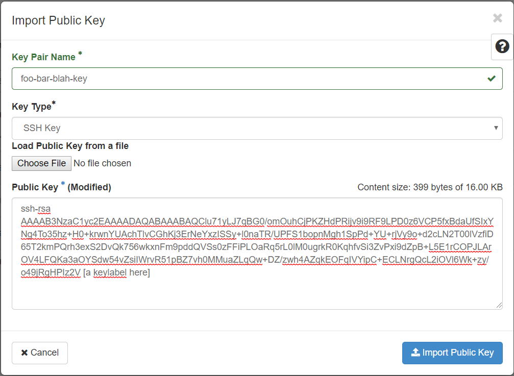

# Creating a keypair for use in Nectar

## Overview
Duration: 2:00

In this tutorial you will learn how to create a Public-Private keypair for use with the Nectar Research Cloud. You will learn one or more methods of creating the keypairs and how to import your public key into your Nectar account.

positive
: **Cloud Starter**
This tutorial is part of the Nectar Cloud Starter curriculum. Only the bare essentials of keys are discussed here for Launching a Nectar VM from the Nectar Dashboard.

### What you'll learn

- How to create a Public-Private keypair for use with your Nectar Virtual Machine/s
- How to import your Public key into your Nectar account

### What you'll need

- [Terminal software](https://support.ehelp.edu.au/support/solutions/articles/6000223964-terminal-software) that has the `ssh-keygen` app installed
- Access to the Nectar Research Cloud

## About keys and Nectar
Duration: 4:00

A Public-Private keypair is used in the Nectar in stead of a password, to log on to any Virtual Machine (VM) you launch in Nectar. You will learn more about Launching and `ssh`-connecting in other tutorials. 

Before you get to that, you need to have a keypair and register your Public key in your Nectar account. 

A Public-Private keypair is a pair of files, your Private key and your Public key. They uniquely belong to each other. Your Private key file is yours, and yours alone. You should securely store it on a location on your computer that is only accessible to you.  Your Public key can be used to authorise and authenticate you in a remote computer account. 

negative
: **Important**
Keep your Private key private and secure

When you launch an instance, Nectar places the Public key from your Nectar account into your VM for you, attached to an admin user account. This way you can use `ssh` to connect to your VM using the three essential connection elements: the computer's IP address, the user account, and the private key that is securely stored on your computer.

positive
: **Theorising v. Hands dirty**
We can theorise until the *bovi eunt domus* but for the purpose of this tutorial we should just get our hands dirty, so...

Let's get a keypair and register it in Nectar. On the next pages you will learn two ways of obtaining a keypair for use with Nectar.

## Nectar convenience method
Duration: 2:00

Nectar can generate a keypair for you. It's easy and your Public key is automatically registered in your Nectar account. You will have to ensure that your downloaded Private key file is in an appropriate and secure location on your computer.

To get your Nectar-generated key you follow these steps

1. Logon to the [Nectar Dashboard]([https://dashboard.rc.nectar.org.au](https://dashboard.rc.nectar.org.au/)) and navigate to Key Pairs page
2. Click the "**+** Create Key Pair" button
   
3. in the Create Key Pair dialog, insert a meaningful name for your key
2. Click the "**+** Create Key Pair" button
   
5. Your Public key is now registered in the list 
2. and your Private key is now downloaded by your browser.
   

Your browser's default download folder is not an appropriate place to store your Private key. You should store your Private key in a suitably permanent place that is only accessible to you. 

1. Create a folder for your Keys  in a suitably permanent place that is only accessible to you. In the remainder of this tutorial we will assume you have created a `.ssh/` directory in your home directory, e.g. (using your local terminal)
   ```bash
   $ cd ~
   $ mkdir .ssh
   ```
   
2. Move your downloaded Private key file into your new key folder.

That's all there's to *the Nectar convenience method*. 


## `ssh-keygen` method

Duration: 4:00

A more generic way to generate a keypair is to use the `ssh-keygen` command from the command line in your terminal. You then need to import your Public Key into Nectar for Nectar use. 

### Generating your keypair

1. Open Terminal. You will start off in your *“home”* directory. If you already had the terminal open before, make sure you are in the home directory, by simply typing
   ```bash
   $ cd ~
   ```
   
1. Now, check if you already have a directory called `.ssh`, by typing 
   ```bash
   $ ls -a
   ```
   A list of files in your home directory will be printed. If you don’t see the name `.ssh` in this list, you can create the directory using the command: 
   ```bash
   $ mkdir .ssh
   ```
   and change to this directory: 
   ```bash 
   $ cd .ssh
   ```
   
1. Now generate the key with 
   (NOTE: you should choose a much better name than "*foo-bar-blah-key*")
   ```bash
   $ ssh-keygen -t rsa -f foo-bar-blah-key
   ```
   `ssh-keygen` will ask you to 
   ```bash
   Enter passphrase (empty for no passphrase):
   ```
   For the purpose of this tutorial you can enter an empty passphrase. 
   `ssh-keygen` generates a pair of keys in the directory `.ssh`.
   
1. Verify that you have the files of your key pair:
   ```bash
   $ ls
   foo-bar-blah-key  foo-bar-blah-key.pub
   ```

A key pair is just a pair of text files. You can view the contents of your key files with any text editor. 

positive
: **Default key location**
The `.ssh` directory that we created and used above, is a default location for private keys. Storing your private key in this location will save you typing the exact key file location every time you connect using `ssh`. More on that in our tutorial on Connecting


### Importing your Public Key into Nectar

To use your key pair with Nectar you need to *Import* your public key (`foo-bar-blah-key.pub` in the example above) into Nectar. 

positive
: **Important**
Make sure you import your **Public** key here, *not the private one*

1. in your Nectar dashboard, navigate to `Compute | Keypairs`
2. Click the `Import Public Key` button
3. In the `Import Public Key` dialog, 
   1. give your public key a **Key Pair Name** (this name doesn't need to match your key's filename or the label. You should choose a name that helps you stay meaningfully organised.)
   2. Select *SSH Key* for **Key Type** 
   3. Load your public key from your public key file (`foo-bar-blah-key.pub` in our example), using the Choose File button and dialog **or**
   4. Paste the text of your public key in the **Public Key** field.
      The completed Import Public Key Dialog should look something like this
      

5. Click the `Import Public Key` button

The name of your key should now be listed in the Key Pairs page on your Nectar Dashboard. 

## A note on file permissions

Depending on your Operating System and your `ssh` software the file access permissions on the directory `~/.ssh` and your private key file  (e.g. `~/.ssh/foo-bar-blah-key`) matter. If this is the case for your situation, you may find that your attempts to establish an ssh-connection fail, with an error message similar to  

```bash
Permissions 0666 for '.ssh/foo-bar-blah-key' are too open.
It is required that your private key files are NOT accessible by others.
This private key will be ignored.
Load key ".ssh/foo-bar-blah-key": bad permissions
```

In this case you should change the *mode* of the `.ssh`-directory to 700 and the mode of the private key file to 600. You can use the `chmod` command to do this, as in the example below

```bash
$ cd ~
$ chmod 700 .ssh/
$ chmod 600 .ssh/foo-bar-blah-key
```

## Next Steps

A key pair is one of the bare necessities for adopting the Nectar research Cloud into your research. In this tutorial you've obtained a key pair and registered it in your Nectar account. You are well one step away from being able to launch your own virtual machines. 

If you haven't already done so, you should learn **the basics of security groups** and then learn to **Launch Virtual Machines** from the Nectar Dashboard. 

positive
: **Cloud Starter**
Congratulations. You've completed one of the prerequisite steps for Launching a Virtual Machine in the Nectar Research Cloud. Keep up the good work. 

