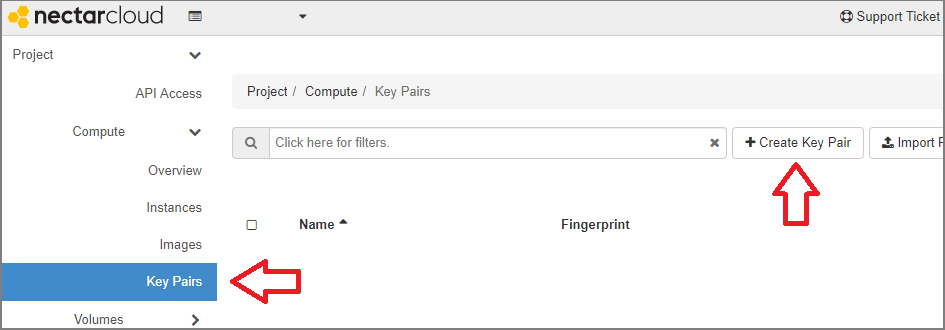
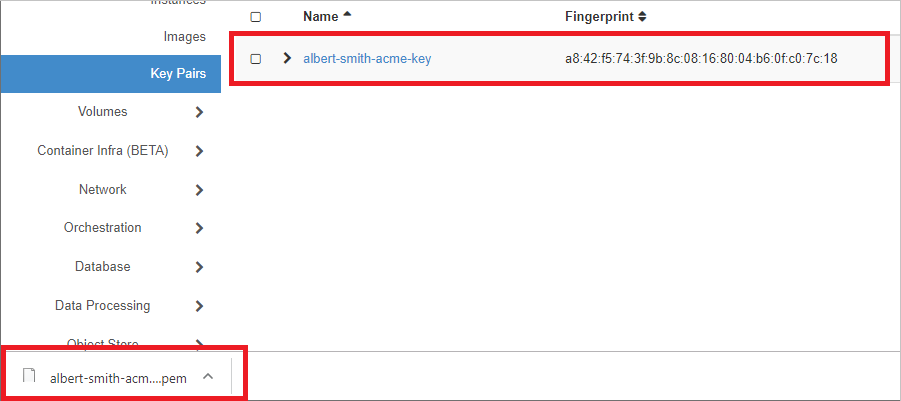

# Creating a keypair for use in Nectar

## Overview
Duration: 2:00

In this tutorial you will learn how to create a Public-Private keypair for use with the Nectar Research Cloud. You will learn one or more methods of creating the keypairs and how to import your public key into your Nectar account.

positive
: **Cloud Starter**
This tutorial is part of the Nectar Cloud Starter curriculum. Only the bare essentials of keys are discussed here for Launching a Nectar VM from the Nectar Dashboard.

### What you'll learn

- How to create a Public-Private keypair for use with your Nectar Virtual Machine/s
- How to import your Public key into your Nectar account

### What you'll need

- [Terminal software](https://support.ehelp.edu.au/support/solutions/articles/6000223964-terminal-software) that has the `ssh-keygen` app installed, or
- PuTTYGen (if you intend to use PuTTY)
- Access to the Nectar Research Cloud

## About keys and Nectar
Duration: 4:00

A Public-Private keypair is used in the Nectar in stead of a password, to log on to any Virtual Machine (VM) you launch in Nectar. You will learn more about Launching and `ssh`-connecting in other tutorials. 

Before you get to that, you need to have a keypair and register your Public key in your Nectar account. 

A Public-Private keypair is a pair of files, your Private key and your Public key. They uniquely belong to each other. Your Private key file is yours, and yours alone. You should securely store it on a location on your computer that is only accessible to you.  Your Public key can be used to authorise in a remote computer account. 

negative
: **Important**
Keep your Private key private and secure

When you launch an instance, Nectar places the Public key from your Nectar account into your VM for you, attached to an admin user account.  

This way you can use `ssh` to connect to your VM using its IP address, the user account, and the private key that is securely stored on your computer.

positive
: **Theorising v. Hands dirty**
We can theorise until the *bovi eunt domus* but for the purpose of this tutorial we should just get our hands dirty, so...

Let's get a keypair and register it in Nectar. On the next pages you will learn 3 ways of getting a keypair for use with Nectar.

## Nectar convenience method
Duration: 2:00

Nectar can generate a keypair for you. It's easy and it means that your Public key is automatically registered in your Nectar account. You will have to ensure that your downloaded Private key file is in an appropriate and secure location on your computer.

To get your Nectar-generated key you follow these steps

- Logon to the [Nectar Dashboard]([https://dashboard.rc.nectar.org.au](https://dashboard.rc.nectar.org.au/)) and navigate to Key Pairs page
- Click the "**+** Create Key Pair" button



- in the Create Key Pair dialog, insert a meaningful name for your key

- Click the "**+** Create Key Pair" button


- Your Public key is now registered in the list 

- and your Private key is now downloaded by your browser.


Your browser's default download folder is not an appropriate place to store your Private key. You should store your Private key in a suitably permanent place that is only accessible to you. 

- Create a folder for your Keys  in a suitably permanent place that is only accessible to you
- Move your downloaded Private key file into your new key folder.

negative
: PuTTY on Windows uses a slightly different Private key file format. If you intend to use PuTTY to `ssh` into your instances, you will need to do a key conversion using PuTTYgen.

## PuTTYgen conversion

Duration: 5:00

Windows users that use PuTTY terminal software and have a Private key in `.pem`-format (e.g. from the Nectar Convenience method or `ssh-keygen`-method) will need to convert their Private key to `.ppk`-format. You can use PuTTYgen for the key conversion.

- If you don't yet have a copy of PuTTYgen, download it from the [PuTTY website](http://www.chiark.greenend.org.uk/~sgtatham/putty/download.html) 
- Launch PuTTYgen you can double click the `puttygen.exe` file
- Click 'Import key' item from the 'Conversions' menu:


- Select the `.pem`private key you want to convert and click 'Ok'.
- Select 'Save private key' from the 'File' menu. 
- Click 'yes' to save your `.ppk`-key *without a passphrase*
- Save the converted private key using the same name as the original key file, but with the `.ppk`-extension


You are now ready use your Private key in `ppk`-format to `ssh`-connect using the PuTTY terminal software.

## ssh-keygen method

Duration: 4:00

You can use the `ssh-keygen` command from the command line in your terminal to create a keypair for Nectar use. 

1. Open Terminal. You will start off in your *“home”* directory. If you already had the terminal open before, make sure you are in the home directory, by simply typing
   ```bash
   $ cd ~
   ```
   
1. Now, check if you already have a directory called `.ssh`, by typing 
   ```bash
   $ ls -a
   ```
   A list of files in your home directory will be printed. If you don’t see the name `.ssh` in this list, you can create the directory using the command: 
   ```bash
   $ mkdir .ssh
   ```
   and change to this directory: 
   ```bash 
   $ cd .ssh
   ```
   
1. Now generate the key with 
   (NOTE: you should choose a much better name than "*foo-bar-blah-key*")
   ```bash
   $ ssh-keygen -t rsa -f foo-bar-blah-key
   ```
   `ssh-keygen` will ask you to 
   ```bash
   Enter passphrase (empty for no passphrase):
   ```
   For the purpose of this tutorial you can enter an empty passphrase. 
   `ssh-keygen` generates a pair of keys in the directory `.ssh`.
   
1. Verify that you have the files of your key pair:
   ```bash
   $ ls
   foo-bar-blah-key  foo-bar-blah-key.pub
   ```

A key pair is just a pair of text files. You can view the contents of your key files with any text editor. 

To use your key pair with Nectar you need to *Import* your public key (`foo-bar-blah-key.pub` in the example above) into Nectar. You will learn this in a next section

positive
: **Default key location**
The `.ssh` directory that we created and used above, is a default location for private keys. Storing your private key in this location will save you typing the exact key file location every time you connect using `ssh`. More on that in our tutorial on Connecting


## PuTTYgen method

Duration: 4:00


## 

## Import Public Key into Nectar


## A note on file permissions

`.ssh/` needs to be 700, or drwx------

`.ssh/private-key` needs to be 600 or -rw-------

## Next Steps

positive
: **Cloud Starter**
Congratulations. You've completed one of the prerequisite steps for Launching a Virtual Machine in the Nectar Research Cloud. 

```

```