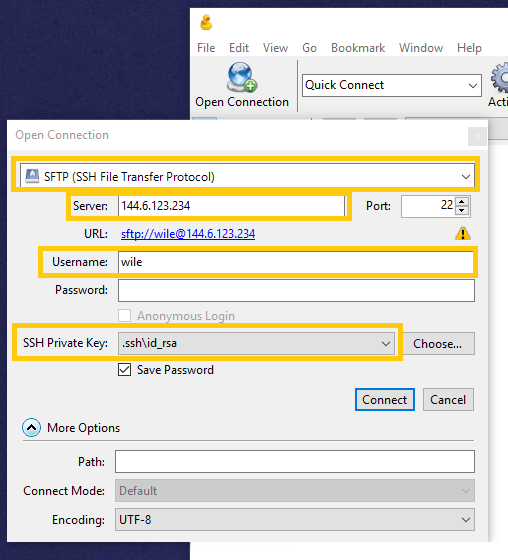

# Moving data

## Welcome

Duration: 1:00

While working with your instance you will almost certainly need to move data to or from it at some stage. There are many options to move data, too many for us to go into all of them. In this tutorial we will show you a few options, that work well. 

### What you'll learn

- using some popular open source tools `scp`, Cyberduck and `rsync`

### What you'll need

- a running Nectar instance, accessible using your openssh key pair. 

## scp

Duration: 10:00

`scp` stands for "secure copy". It relies on `ssh`, which in practice means for us that we can use the same key pair access methods for both `scp` and `ssh`. `scp` copies files between hosts on a network. The command will take a variation of this form; we will explore some of the variations below.

```bash
$ scp source-file destination-file
```

positive
: **Default or custom private key name/location**
If you have your private key either in the default location of `~/.ssh/id_rsa` then you don't need to specify it to the `scp` command. If you have a custom name or location, then you need to specify it to `scp` using the `-i` argument, e.g. `scp -i /path/to/your/private_key ...`

### To copy from local to remote...

To copy a file called `data.csv` from the local machine to our remote instance we could use this command.

```bash
$ scp data.csv wile@144.6.123.234:~/data-dir/
```

Here we're running the `scp` command from the directory where  the *source-file* `data.csv` is located, so we can refer to it by filename without further path information. The *destination-file* is specified with the connection details to our remote instance: the username `wile`, the `@`, the host IP address `144.6.123.234` and the colon (`:`). You need to find and substitute the remote username and host IP address for your situation. 

The part after the colon (`:`) indicates the remote path. Here we are copying the file to the home-directory (`~/`) of the user (`wile`) into a subdirectory (`data-dir/`). The file will be copied using the origrinal name (`data.csv`). Note that the directory 'data-dir' need to exist. 

Here's another example:

```bash
$ scp /collections/geococcyx/data.csv wile@144.6.123.234:geococcyx-data.csv
```

Here we use the `scp` command, refer to the local  *source-file* by its absolute path (`/collections/geococcyx/data.csv`), connect to the remote host using connection details (`wile@144.6.123.234:`), copy to the default directory for the connecting user (no path specified after the colon) and we *rename* file as part of the copy process to `geococcyx-data.csv`. Again: you need to find and substitute the remote username and host IP address for your situation. 

Easy.

### To copy from remote to local...

The copy from remote to local is very similar, except we now need to specify our remote connection details for the *source-file*, and we can omit any connections details for the *destination-file*.

```bash
$ scp wile@144.6.123.234:~/outputs/results.dat outputs/
```

Here we use the `scp` command, we connect to the remote instance using the connection details: `wile@144.6.123.234:`, and specify the remote *source-file* 'results.dat' in the user (`wile`'s) home directory, subdirectory outputs (`~/outputs/results.dat`). We specify the destination directory `outputs/` but we retain the source-file filename `results.dat`. Note that the directory 'outputs' needs to exist. Again: you need to find and substitute the remote username and host IP address for your situation. 

In the examples above we've shown some variations of the basic form of `scp` commands to move data between your local machine and your remote instance. `scp` is a powerful tool; we suggest you have a read of the `man` pages (run `$ man scp`) to get an idea of the options that `scp` takes. Being a command line tool, it can be easily automated or scheduled. 


## Cyberduck

Duration: 6:00

Command line applications are great, and can easily be automated and scheduled using standarsd interfaces. Some people prefer graphical tools however to help visualise the scenarios and options for their data moving tasks. 

[Cyberduck](https://cyberduck.io) is a graphical tool for moving data. It supports a host of storage protocols We'll be using SFTP to create a connection to our instance and move copy some data there and back.

positive
: Cyberduck is one of many options for graphical data moving tools. Other popular options include FileZilla (cross platform) and WinSCP

When you open Cycberduck you just click the Open Connection button. In the Open Connection dialog you fill in the relevant details. Select **SFTP (SSH File Transfer Protocol)**. Enter your host IP address as **Server**(the ip address of your instance). Enter the **Username** you use to enter your instance. Select the **SSH Private Key** that you use to access your instance (you may have to browse for is using the *Choose...* button). Click **Connect**.




We'll let you work out how to *Double click*, or *Drag-and-drop* files, *Create remote directories*, *Upload files*, *Save/Reuse session data* and *Disconnect* for yourself on your particular platform. 


## rsync