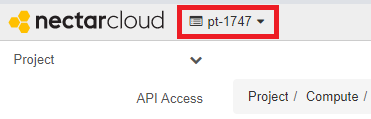
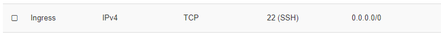

# Security groups, the absolute basics

## Overview
Duration: 4:00

### What are Security Groups and Rules

Security Groups are Nectar's way of specifying what network traffic can reach into -and out of- your Virtual Machine (VM). By default a VM brought up in the Nectar Research Cloud can reach out to the world via the network, but the world can’t reach in.

You need to specify any network traffic to be allowed to reach the VM via the Rules in a Security Group.

Security groups can be applied to VMs at launch and can be applied or removed at any other time in the VMs life. 

positive
: **Cloud Starter**
This tutorials is part of the Nectar Cloud Starter curriculum. Only the bare essentials of security groups are discussed here. For more in depth review see the Nectar [Security Group documentation](https://support.ehelp.edu.au/support/solutions/articles/6000055387).

### What you'll learn

- Create a basic security group and a rule, for `ssh`

### What you'll need

- An account on the Nectar Research Cloud

## Inspect your Security Groups

Duration: 3:00

Access to Nectar Research Cloud resources is organised in *projects* and there are a few different types of them. If you're reading this, it is likely that you are using a *personal trial* (or *pt-*) project. If this is the case you probably already have some pre-configured security groups. 

If you're in a project with other users, then it is possible that they have already created Security Groups and Rules. 

With the steps below you'll inspect your existing Security Groups and Rules. 

1. Logon to your Nectar Dashboard at [https://dashboard.rc.nectar.org.au](https://dashboard.rc.nectar.org.au/)
1. Ensure the Project Selector (top left hand side of the page) indicates the project you want to work in:
   
1. Navigate to `Project | Network | Security Groups` in the navigation panel on the left hand side.

You will now see a list of the Security Groups that are available in your project. 

positive
: **ssh group**
By the end of this tutorial you need to have a Security Group that will allow you to connect to an instance using `ssh`. 

If you see a group that is named `ssh` or similar, then 

1. Click the `Manage Rules` option in the Action Menu button beside this group

A list of `Rules` is displayed that are part of this Security Group. 

If your Security Group contains this rule, then your project is all set for launching an instance and connecting via `ssh`. The next two sections are optional for you, but we do recommend you give them a go: there is every chance that at some stage in your Nectar career you'll use your skills in creating and adjusting *security groups* and their *rules*.

If you didn't find a group named `ssh` or similar, or didn't find a group containing the the `ssh`-ingress rule as above, then you should proceed with the next two sections, where you'll learn how to Create a Security Group and Create the `ssh`-rule. 

## Create a Security Group

Duration: 4:00

You can create Security Groups on the Nectar Dashboard `Securty Groups` page, so if you're not already there:

1. Navigate to `Project | Network | Security Groups` in the navigation panel on the left hand side.
2. Click the button **+** Create Security Group
3. Give your Security Group a meaningful **Name** and optionally a **Description**. For the purpose of this tutorial we recommend the name `ssh`
4. click Create Security Group to finalise this step. 

negative
: **Unique Names**
Although you can use duplicate names for Security Groups, it will make your life harder if you do so. We recommend you don't.

You have now created a Security Group and you are ready to configure it with the right Rules. 

### Manage Rules

1. Click the "Manage Rules" option on the Action Menu button for the group you created above. 
   Two Egress rules should be visible. To add the `ssh` rule
2. Click the **+** Add Rule button.

In the Add Rule dialog, select the Rule SSH in the **Rule** selector.

positive
: **SSH is special**
Because the SSH rule is a very commonly used rule, it is preconfigured in Nectar. You'll see that the Add Rule dialog changes to show fewer fields upon selecting the SSH rule. 

Just click the Add button to complete this step. You have created a Security Group and configured it with the `ssh` rule. 

## Applying Security Groups 

Duration: 1:00

Security Groups are applied to Virtual Machines to allow them to receive network traffic. Typically you apply Security Groups when you Launch your VM, but you can add security groups to your VM at a later time too; Or indeed remove security groups from your VMs

negative
: **Changing Rules on Existing Security Groups**
You can also add Rules to- or remove rules from existing Security Groups. You should be mindful that this will affect all VMs that use the group, including pre-existing VMs. 

## Next Steps

Duration: 1:00

Security groups and their rules are essential for securing virtual machines in the Nectar research cloud. In this tutorial you have learnt how to inspect, create and adjust a security group and rules. Securing virtual machines is important and deserves its own tutorial and documentation. 

If you haven't already done so, you should **create a key pair for use in Nectar** and then learn to **Launch Virtual Machines** from the Nectar Dashboard

positive
: Well done.
You've completed one of the three prerequisite steps launch and connect to a VM in the Nectar Cloud. 

