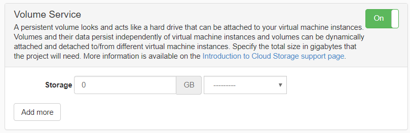
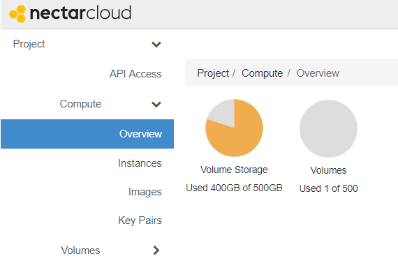
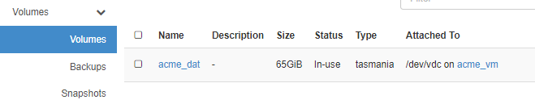
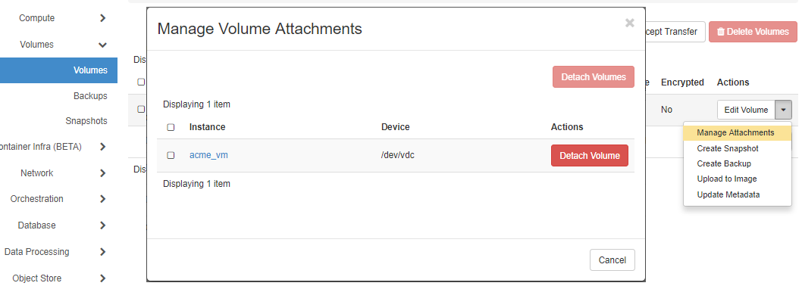

# Volume Storage

## Overview

Volume storage ("volumes") is Nectar's way of providing you with disk space. Volumes  are virtual devices; they can live alongside your virtual machine. A volume's life cycle is independent of a virtual machine, but manipulating data on a volume typically requires that it is *attached* to a virtual machine. An attached volume appears to your operating system as a block storage device and is typically used to hold a file system. It is then mounted into your operating system, making the storage available to your applications. Volumes can be unmounted and detached from a VM and attached to and mounted on another. Data on a volume persists even when you terminate your virtual machine. You can make bootable volumes, you can use volume snapshots and a volume can be transferred to another project.

In this tutorial you will learn the basics on how to use Volume Storage in Nectar. You will require a suitable volume allocation. You will learn to create, attach and detach volumes using the Nectar dashboard. You will use Linux commands to format (if necessary), mount and unmount your volumes, and check your volume's usage.  

### What you'll need

* a running instance in a Nectar project
* a volume storage quota allocated in your project

### What you'll learn

* *create*, *attach* and *detach* volumes using the Nectar dashboard.
* the Linux commands to format (if necessary), mount and unmount your volumes
* check your volume's usage.  

## Allocation for  Volume Storage
A volume storage allocation can be requested using the Allocation Request form, under Allocations on your dashboard, either as part of a New Request (resulting in a new project) or as an amendment to an existing project under My Requests. 

Like instances, volumes are hosted in an availability zone and importantly volumes can only be attached to instances running in the same availability zone. When requesting a volume storage allocation, you will need to consider where your solution will be hosted.




## Create and Attach

### Create a volume

You can see your project's volume storage allocation on the Project | Compute | Overview page on your Nectar dashboard, e.g. 




To create a volume 

- On your Nectar [Dashboard](https://dashboard.rc.nectar.org.au/);
- navigate to Volumes | Volumes;
- click the '+ Create Volume' button;
- give your volume a meaningful name and description;
- specify a 'Volume Source' to determine how the volume will be built;
- specify the size of the volume in GB;
- enter an 'Availability Zone' (this must be the same availability zone as any instance it will be attached to);
- click 'Create Volume' button.

When selecting Image for Volume Source, you will be able to select an image from the image catalog. This is useful for creating bootable volumes.

When selecting Volume for Volume Source, you will be able to select from the existing volumes in your project. 

### Attach a volume

You can attach the volume created earlier to a running virtual machine. See the below instruction:

- On your Nectar [Dashboard](https://dashboard.rc.nectar.org.au/);
- navigate to Volumes | Volumes;
- from the ActionMenu for the Volume, select 'Manage Attachments'
- in the Attach to Instance section of the 'Manage Volume Attachments' dialog, select the instance to attach your volume to.
- click 'Attach Volume' button

Nectar will now attach your volume to the selected instance. When this is complete your volume (on the Volumes | Volumes page) will show a value in the Attached To column similar to `/dev/vdc on acme_vm` in the example screenshot below.



## Format and Mount

negative
: **Warning** 
Formatting a device/volume erases all existing data on a device, if a file system already exists on the target device/volume.
If you need to retain the data on your volume, you should skip to the `mount` section below.

You can verify the device name that your attached volume will have in your instance in the Attached To column on the Volumes | Volumes page on your Nectar dashboard. 

In your instance you can see the attached Volume as a Block Device using the lsblk (list block devices) command. 
```
$ lsblk
NAME   MAJ:MIN RM SIZE RO TYPE MOUNTPOINT
vda    252:0    0  10G  0 disk
└─vda1 252:1    0  10G  0 part /
vdb    252:16   0  60G  0 disk /mnt
vdc    252:32   0  65G  0 disk
```

Depending on how you created your volume, it may not have a file system and you need to create one before mounting, i.e. format the device. The exact format command syntax is dependent on the virtual machine's operating system and the type of file system you need. The example below formats the volume attached as `/dev/vdc`' in the Ubuntu-based instance using the `ext4` filesystem. 

```
$ sudo mkfs -t ext4 /dev/vdc
```
To make your volume/device available to the operating system you need to mount it on a directory called a mount point. You can mount your device using an *in-memory-only mount*, but the mount will be lost upon rebooting your instance. We recommend you configure the mounting of your device/volume filesystem persistently using the configuration file `/etc/fstab`. In both examples we will create a mount point called `/pvol`.

### In memory only 
You can use below commands to create a mount point called /pvol and  to mount the device `/dev/vdc` at that mount point.

```bash
$ sudo mkdir /pvol
$ sudo mount /dev/vdc /pvol -t auto
```
### Using /etc/fstab 
 To ensure that your Volume is remounted after a reboot of your instance, you should configure it in the file `/etc/fstab`. 

First create the mount point `/pvol` using:

```
$ sudo mkdir /pvol
```
Then use a text editor to add the following line to `/etc/fstab`, where `/dev/vdc` is the device you're mounting and `/pvol` is the its target mount point.

```
/dev/vdc  /pvol    auto    defaults,nofail   0  2
```
After adjusting the `/etc/fstab` file you need to initiate any changes. Use the mount all command:

```
$ sudo mount --all
```
You may have to change ownership or write privileges to enable writing to the ephemeral storage, using chown, chgrp or chmod, e.g.

```
$ sudo chown ubuntu:ubuntu /pvol
```
* your use-case or operating system may require different details or a different approach than this example. 


## Unmount and Detach

You can use the `umount` command (note the spelling of the `umount` command) to unmount your device from its mount point (here `/pvol`). E.g.

```
$ sudo umount /pvol
```

You can use the Nectar dashboard to detach a volume from an instance. Navigate to the Volumes | Volumes page, and use the ActionMenu for your volume to show the Manage Volume Attachments dialog. (Alternatively you can use the ActionMenu of the instance on the Compute | Instances page)




Notes: Volumes **must** be detached before deletion.


## Check your Storage

You attached and mounted volume storage will behave like any other disk/block device in Linux. Here are some commands that can help you to look at your mounted storage blocks and keep track of their usage:

`lsblk` for Listing Block devices

```
$ lsblk
```
`df` for free disk space

```
$ df -hT
```
`du` for disk usage

```
du -h <path/to/directory>
```
Don't forget you can access the `man`-pages for these commands like this:

```
$ man lsblk
$ man df 
$ man du
```

## Next Steps


Well done. Create, attach, detach and delete volumes from your project using the Nectar Dashboard. You've also learnt how to format your attached volume from the command line, and how to mount and umount your device. 


Additional tricks you can do with Nectar volumes are you can [Resize them](https://support.ehelp.edu.au/support/solutions/articles/6000185794-increasing-a-volume-size), take volume snapshots, transfer a volume to another project and make them a boot source for instances. 

