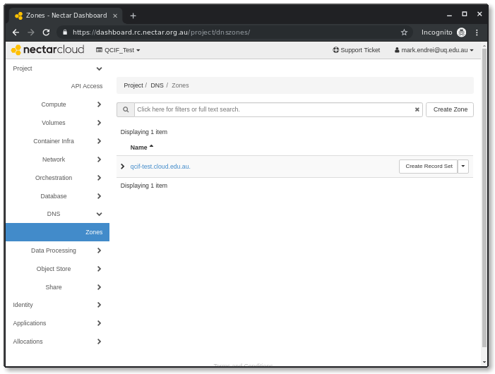
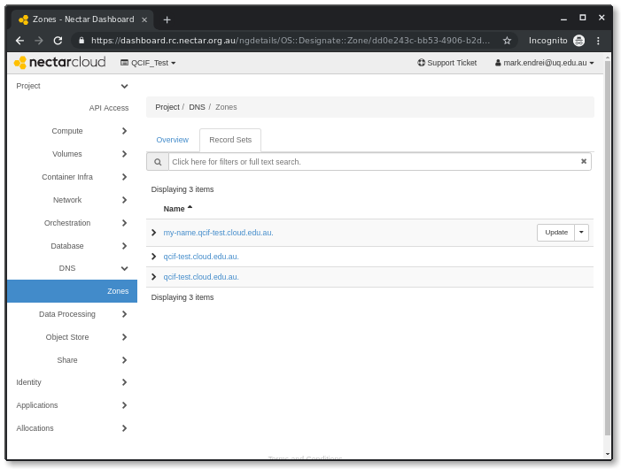
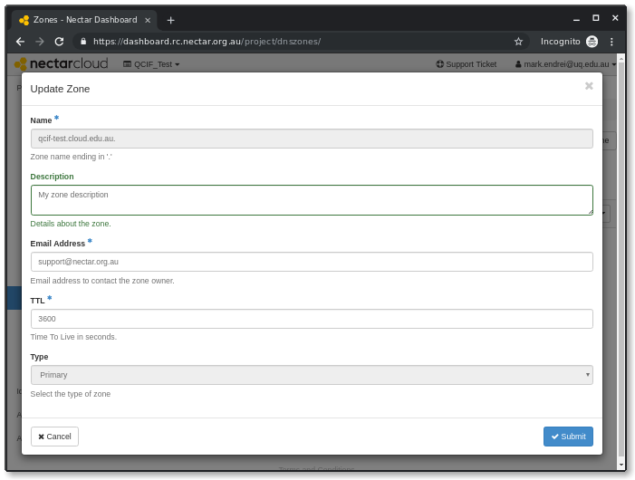
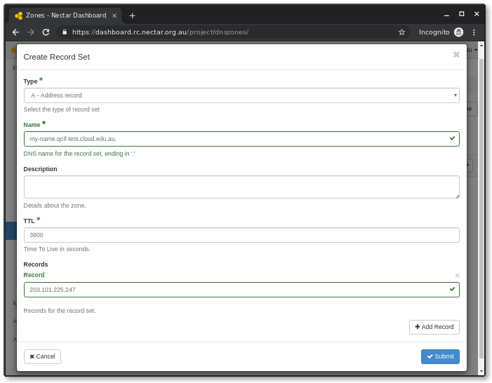
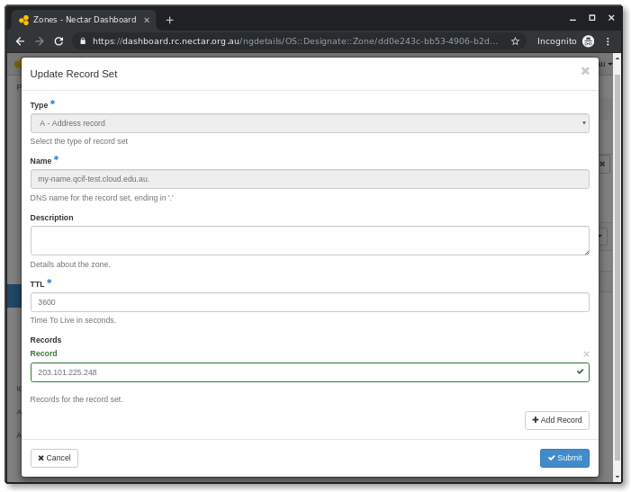

# DNS with Designate

## Overview

The Nectar DNS Service allows users to add Domain Name System (DNS) services to their Nectar Research Cloud projects, based on the OpenStack DNS as a Service project, *Designate*.

### Nectar Provided Zone

For new projects and projects with allocations being renewed, a Nectar provided DNS zone will be created automatically for your project to use. The zone name will be based on your given project name, and will be available for you to create records in right away.

### Bring Your Own Zone

The Nectar DNS service can also host a domain name you currently own. If you would like to host your domain on the Nectar DNS service, please file a support request and we will create the zone for you.

Once you have a zone created for your project, you are free to create and delete any records you wish within this zone.

If you do choose to host your domain with us, you will need to set the *Nameserver* records of your domain to:

```
ns1.rc.nectar.org.au (115.146.81.148)
ns2.rc.nectar.org.au (115.146.83.183)
```

for the entries to resolve properly.

### Using the Nectar DNS Service

To use the service, we offer a few methods:

- Your [Nectar dashboard](https://dashboard.rc.nectar.org.au)
- OpenStack [Command Line Interface (CLI)](tutorial/openstack-cli)
- Python OpenStack bindings
- Interacting with the OpenStack API directly

You will require your Nectar OpenStack password for CLI, Python bindings, and direct API access.

positive
: **Note**
The Nectar DNS service supports Designate API v2 only.

### Nectar Dashboard and CLI

We will show you how to access DNS service functions using the dashboard and CLI coming up in this tutorial.

### Python Bindings

The `python-designateclient` package provides the Python bindings required to interact with the Nectar DNS service though the Python programming language.

Please see the [OpenStack Python Bindings](https://docs.openstack.org/python-designateclient/latest/user/bindings.html) reference material

### API Reference

If you would like to interact with the HTTP REST API directly, you can find the [OpenStack API Documentation](https://developer.openstack.org/api-ref/dns/)

### What you'll learn

- Managing DNS services for your Nectar Project

### What you'll need

- Access to a Nectar Project
- Access to the Nectar OpenStack CLI (optional)

## Inspect your DNS Zones and Record Sets



A default DNS zone based on the allocation project name is provisioned for all new Nectar allocations (and amended allocations). You can check that your project has the default zone as follows: 

```
$ openstack zone list
+-----------+-------------------------+---------+----------+--------+--------+
| id        | name                    | type    |   serial | status | action |
+-----------+-------------------------+---------+----------+--------+--------+
| <zone id> | <project>.cloud.edu.au. | PRIMARY | <serial> | ACTIVE | NONE   |
+-----------+-------------------------+---------+----------+--------+--------+
```

If the default zone is not listed, your project was created before the Nectar DNS service was available. Please email [support@nectar.org.au](mailto:support@nectar.org.au) requesting that the default zone be added to your project.



## Update a Zone



## Create a Record Set



You can now create a DNS record for your instance in the zone as follows:

```
$ openstack recordset create <project>.cloud.edu.au. <instance name> --type A --record <instance IP addr>
```

Check that the record was created correctly using:

```
$ openstack recordset list <project>.cloud.edu.au.
+------+-----------------------------------------+------+--------------------+--------+--------+
| id   | name                                    | type | records            | status | action |
+------+-----------------------------------------+------+--------------------+--------+--------+
| ...  |                                         |      |                    |        |        |
| <id> | <instance name>.<project>.cloud.edu.au. | A    | <instance IP addr> | ACTIVE | NONE   |
| ...  |                                         |      |                    |        |        |
+------+-----------------------------------------+------+--------------------+--------+--------+
```

To check that the DNS name is working, you can try accessing the instance with ssh as follows:

```
ssh -i <keyfile> ubuntu@<instance name>.<project>.cloud.edu.au
```

If you are managing your DNS records with a domain name registrar (rather than with the Nectar DNS Service) they will typically provide a web portal with similar record management functionality.

## Update a Record Set



```
$ openstack recordset set dd0e243c-bb53-4906-b2dc-ef81334243b0 879559ca-6e0d-4609-8372-5ed96d333d4e --records 203.101.225.248
+-------------+--------------------------------------+
| Field       | Value                                |
+-------------+--------------------------------------+
| action      | UPDATE                               |
| created_at  | 2019-08-23T05:34:59.000000           |
| description | None                                 |
| id          | 879559ca-6e0d-4609-8372-5ed96d333d4e |
| name        | nectar-tut.qcif-test.cloud.edu.au.   |
| project_id  | 100bc16dc5a148f18c2c3d1822e6a61d     |
| records     | 203.101.225.248                      |
| status      | PENDING                              |
| ttl         | 3600                                 |
| type        | A                                    |
| updated_at  | 2019-08-23T07:46:04.000000           |
| version     | 2                                    |
| zone_id     | dd0e243c-bb53-4906-b2dc-ef81334243b0 |
| zone_name   | qcif-test.cloud.edu.au.              |
+-------------+--------------------------------------+
```

## Delete a Record Set

## Next Steps

