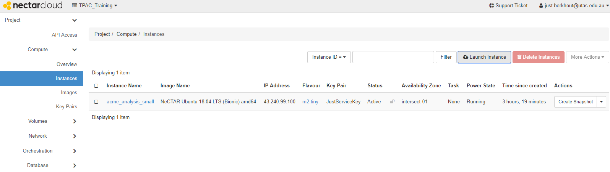
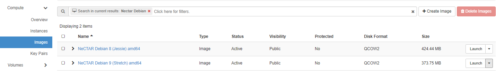

# Launching Virtual Machines

## Overview

Duration: 3:00

### What is Launching

In Nectar you can create your own Virtual Machines. We call it *Launching*.  From your Nectar dashboard it is easy to start the launch dialog, and from there it is straightforward to create a basic Virtual Machine. 

In this tutorial you'll step through the launch dialog to configure the options for creating your Virtual Machine. And just in case you're wondering: yes we use the word _Instance_ a lot: in Nectar it is synonymous with *Virtual Machine*.

positive
: **Cloud Starter**
This tutorial is part of the Nectar Cloud Starter curriculum. You should be familiar with the absolute basics of Security Groups, you should have a Keypair and you should have terminal software installed on your machine. If you  think you need help with any of that, you should complete Cloud Starter tutorials before  you start here. 

### What you'll learn

- Launch a Virtual Machine in your Nectar Porject

### What you'll need

- Security Group to allow `ssh`
- Keypair
- Terminal software
- Access to a Nectar Project

## Starting the Launch Dialog

Duration: 3:00

In this tutorial we will use the Launch Dialog and configure the most basic Virtual Machine we could think of. 

- Log on to on your [Nectar Dashboard](https://dashboard.rc.nectar.org.au) and ensure you're working in the right project (Use the project selector on the top left-hand side)
- Navigate to the `Project | Compute | Instances` page 
- Click the `Launch Instance` button to start the Launch Dialog

- Alternatively you can navigate to the `Project | Compute | Images` page, find an Image, and Click *Launch* on the Image’s Action Menu Button

## Details, Source and Flavor

### Filters

## Networks, Security Groups and Key Pair

### Optional tabs

## Launch Instance

## Next Steps

