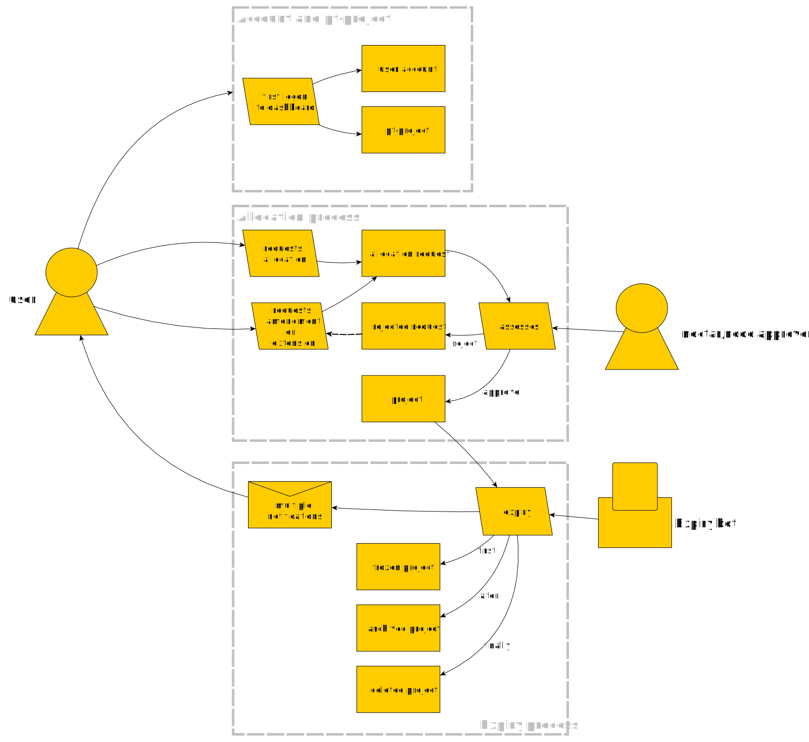
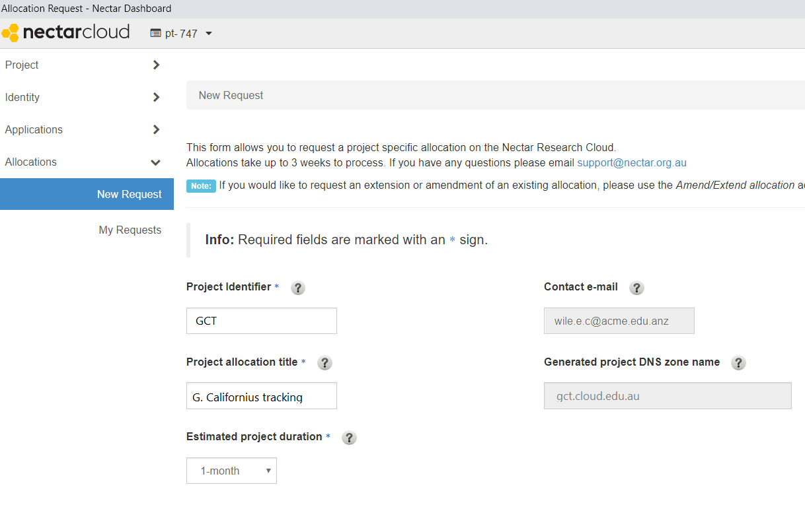

# Allocation Management

## Overview

*Allocations, Quota, Resources, Accounts, Projects...* These are some of the words that we use here at Nectar to help you and other Nectar users organise access to the Nectar Research Cloud. Making the most of the Nectar Research Cloud requires that you familiarise yourself with this language and with the associated processes. 

Nectar Cloud resources are granted to you in periods of up to a year. An automated expiry process will recover unused and unclaimed resources and the recovered resources can then be granted out to researchers just like yourself. 

negative
: **Warning**
Familiarise yourself with the expiry process, to prevent surprise deletions of your hard work and data. 

negative
: **Antarctica and Amazon (the rainforest)**
The Expiry Bot diligently executes the expiry process. It does not know of your field trips to Antarctica or the Amazon rainforest, or any other places where wifi-access or your attention to emails may be limited. Make sure you have arranged extensions for your projects if you happen to be away for extended periods or delegate your project manager role to another user. 

### A diagram

### What you'll learn

- Understanding *accounts*, *allocations*, *projects*, *resources* and *quota*
- Requesting and Amending allocations
- *Allocation expiry*
- Delegating the *Project Manager* role to another user

### What you'll need

- A Nectar Research Cloud account, or access to the AAF to get one. 

## Accounts and Personal Trial (pt) projects

The first time you log on to the dashboard, Nectar creates two things your *Account* and a *Personal Trial (pt)* project. Your account is tied to your email address, while your personal trial is a project named pt-*xyz* (where *xyz* is a number). The two are closely related, but they are not the same thing.

### Your Nectar Account

You log on to [Nectar dashboard](https://dashboard.rc.nectar.org.au/) using [AAF](https://aaf.edu.au/) (in Australia) or [Tuakiri](https://www.reannz.co.nz/products-and-services/tuakiri/) (in New Zealand). AAF and Tuakiri provide both authorisation and authentication, using your identity (i.e. username) at your home institution.

You account is created upon your first logon. You account is associated with your email address and will contain some account-related information, such as your public-private key pairs (when you register them), your Nectar OpenStack password or any Application Credentials you might create. 

positive
: Your Nectar OpenStack password is not the same thing as your AAF/Tuakiri password. Read more about the Nectar OpenStack password in our [knowledge base article](https://support.ehelp.edu.au/support/solutions/articles/6000145832-the-nectar-openstack-password). Note also that [Nectar OpenStack Application Credentials](https://support.ehelp.edu.au/support/solutions/articles/6000212274-application-credentials) are a more sophisticated solution than the Nectar OpenStack password.

### Your pt-project

Upon your first logon Nectar creates a trial project for you,m know as your *pt*-project (or *personal trial*). In this project you are allocated a very limited 2vCPU of resources for a maximum of 6 vCPU-month of running time. 

Your pt-project is like a full-fledged project in many ways. It is the home of instances, it has an allocation, it houses your project-related things, such as Security Groups

In other ways your pt-project is different from full-fledged projects. It has limited *limited resources* (2 vCPU for up to 6 vCPU-months). You can't share you pt-project with others; the is no user management to grant access to other Nectar users. You git your pt *no questions asked*; there is no application or allocation process. Your *pt-project* is useful for trialing or indeed completing Nectar tutorials.

After you have used all the compute time allocated to you in your pt-project it will expire. If you have built up anything valuable in your pt-project you can request that we *Convert you trial project* when you submit a request for a project allocation. Note that the Expiry Bot will start removing instances from your pt-project shortly after pt-project expiration. To retain them by using a trial project conversion, you need to request a project timely. More detail in the section Project Trial in our article on [Expiry and Renewal](https://support.ehelp.edu.au/support/solutions/articles/6000171494-project-allocation-expiry-and-renewal) 

## Allocation process and Projects

To get a full-fledged project allocated to you you need to apply for an allocation using the`Allocation | New Request` form available from your Nectar dashboard. Once approved informed by email and you will be the *project manager* of your new project. 

To be eligible for a Nectar national allocation you have to submit details of your nationally relevant grant or funding program. If you don't have such a grant, then you can still be allocated cloud resources by the participating nodes under node discretion, by specifying a *Allocation home location* in your request. 

In your request you need to specify the cloud resources that you intend to use. If you're not perfectly sure just yet, then that's all right. You will be able to request amendments to your project. We'll describe that below. 

positive
:  More info can be found in the section [Allocations](https://support.ehelp.edu.au/support/solutions/folders/6000230417) in our knowledge base, including our current [Research Cloud National Allocation Scheme (RC-NAS) Policy](https://support.ehelp.edu.au/support/solutions/articles/6000191233-research-cloud-national-allocation-scheme-rc-nas-policy-)

### Allocation requester and project manager

The user that requests an allocation/project will automatically become both a Member and the Project Manager of that project when it is approved. 

Project managers have access to a few functions that ordinary project members don't have:

- User management
  The project manager can add additional members to the project. 
- Project listed in *My Requests*, *Amend/Extend* ability
  Under `Allocations | My Requests` the request for the project is available to project managers. This gives access to the `Amend/Extend allocation` button
- Allocation and Expiry process communications
  Emails regarding expiry and allocation Amend/Extend requests are visible to all project managers. 

positive
: Occasionally you might come across the term *tenancy* or *tenant-manager*. These art deprecated, dareth I say archaic, words meaning *project* and *project manager* respectively. 

### Amending and Extending

* additional resources
* additional time

## Project Expiry

- rules for expiry
- limited archiving

More detail in the section Project Allocation in our article on [Expiry and Renewal](https://support.ehelp.edu.au/support/solutions/articles/6000171494-project-allocation-expiry-and-renewal) 

## Users in your projects

user management (selve serve) user must have a Nectar account

project manager role (ask dhd) for delegation of project manager tasks.

Project managers are in on the Expiry process notifications and can request amendments/extensions. Good for delegation, 